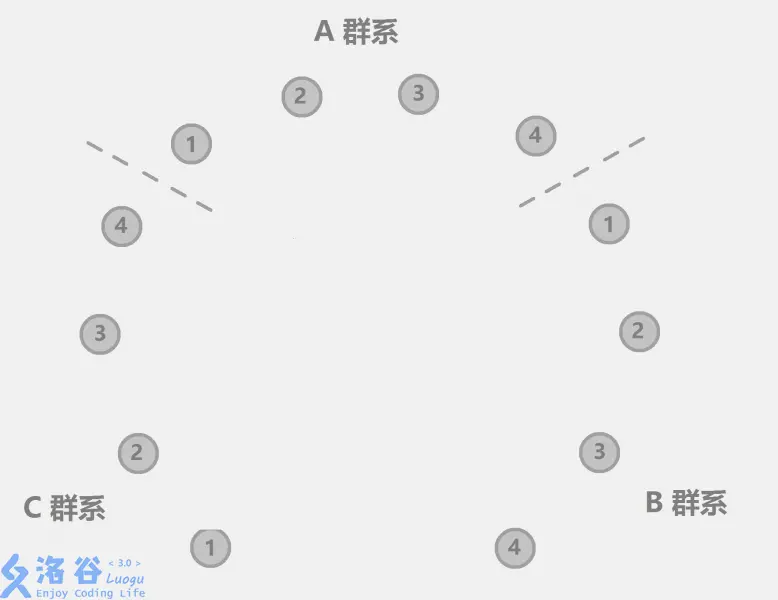

# luogu2024 食物链

题目链接: [https://www.luogu.com.cn/problem/P2024]

## 题意



有三个种类，其关系是: A吃B, B吃C, C吃A；
给出一系列命题，对于每个命题：

- 首先判断数据合法性，以及是否与前面的真命题冲突
- 如果合法且不冲突，将这个命题作为真命题维护

最终输出不为真命题(假话)的数量

## 分析

### 前置

使用并查集维护等价的命题关系：

- $\text{如果并查集内命题}p\text{和命题}q\text{处于同一个集合，那么}p\text{、}q\text{必然同时为真或同时为假}$

### 本题

<!-- - 令(x - 序号,r - 种类)表示命题'序号为x的动物的种类为r' -->

- $\text{令(x - 序号,r - 种类)表示命题'序号为x的动物的种类为r'}$
- $\text{例如，}(2,A)\text{和}(3,B)\text{分别表示序号为}2\text{的动物种类为A,序号为}3\text{的动物种类为B; }$
- $\text{将}(2,A)\text{和}(3,B)\text{放到一个集合的含义为：}$
  - $\text{如果}2\text{的种类为}A\text{，那么}3\text{一定为B，如果}3\text{的种类为}B\text{，那么}2\text{一定为}A.$

那么对于每一个命题，以 $x->y$(x吃y) 为例：

- 判断是否和前面的冲突：
  - 查看 $(x,A)$ 和 $(y,A)$ or $(y, C)$ 是否在一个集合
  - 如果在的话，这是假话；否则为真话；
- 维护真命题 $x->y$ (x吃y):
  - 枚举 $x->y$ 在 ABC 三个种类中所有的可能性：
    - 若 $x$ 的种类为 $A$, 那么 $y$ 一定为 $B$, 反之同理；
    - 若 $x$ 的种类为 $B$, 那么 $y$ 一定为 $C$, 反之同理；
    - 若 $x$ 的种类为 $C$, 那么 $y$ 一定为 $A$, 反之同理；

对于 $x$、$y$ 属于同类的命题也是同样的判断和维护流程。
在下面的代码中,

- fa[1 ~ N] 对应命题 (x, A), #序号为x的动物种类为A
- fa[(N+1) ~ 2N] 对应命题 (x, B), #序号为x的动物种类为B
- fa[(2N+1) ~ 3N] 对应命题(x, C), #序号为x的动物种类为C

---

## 代码

::: code-tabs#shell
@tab python

```python
class DisjointSet:
    def __init__(self, n):
        self.fa = []
        for i in range(n + 1):
            self.fa.append(i)
    def find(self, x):
        x = int(x)
        if self.fa[x] == x:
            return x
        else:
            self.fa[x] = self.find(self.fa[x])
            return self.fa[x]
    def union(self, x, y):
        nx = self.find(x)
        ny = self.find(y)
        self.fa[ny] = nx
    def same(self, x, y):
        return self.find(x) == self.find(y)

ipt = input().strip()

n, m = map(int, ipt.split(" "))
s = DisjointSet(3 * n + 1)
# print(n, m)

ans = 0
for i in range(m):
    ipt = input().strip()
    op, x, y = map(int, ipt.split(" "))
    if x < 1 or x > n or y < 1 or y > n:
        ans += 1
        continue
    if op == 1:
        if(s.same(x, y + n) or s.same(x, y + 2 * n)):
            ans+=1
            continue
        s.union(x, y) #(x,A)->(y,A)
        s.union(x + n, y + n) #(x,B)->(y,B)
        s.union(x + 2 * n, y + 2 * n) #(x,C)->(y,C)
    else: #x->y
        if(s.same(x, y) or s.same(x, y + 2 * n)):
            ans+=1
            continue
        s.union(x, y + n) #(x,A)->(y,B)
        s.union(x + n, y + 2 * n) #(x,B)->(y,C)
        s.union(x + 2 * n, y) #(x,C)->(y,A)

print(ans)
```

@tab cpp

```cpp
#include <algorithm>
#include <cstring>
#include <cstdio>
#include <cmath>
#include <queue>

#define N 300005

using namespace std;

int fa[N];
int n, m, cnt;

int find(int x)
{
	if(fa[x] == x) return x;
	else return fa[x] = find(fa[x]);
}

int main()
{
	scanf("%d%d", &n, &m);

	for(int i = 1; i <= n; ++i)
	{
		fa[i] = i, fa[i + n] = i + n, fa[i + 2 * n] = i + 2 * n;
	}
	for(int i = 1; i <= m; ++i)
	{
		int c, x, y;
		scanf("%d%d%d", &c, &x, &y);
		if(x > n || y > n)
		{
			++cnt;
			continue;
		}
		int ax = find(x), bx = find(x + n), cx = find(x + 2 * n);
		int ay = find(y), by = find(y + n), cy = find(y + 2 * n);
		if(c == 1)
		{
			if(ax == by || ax == cy)
			{
				++cnt;
				continue;
			}
			fa[ax] = ay, fa[bx] = by, fa[cx] = cy;
		}
		else //if(c == 2)
		{
			if(ax == ay || ax == cy)
			{
				++cnt;
				continue;
			}
			fa[ax] = by, fa[bx] = cy, fa[cx] = ay;
		}
	}

	printf("%d", cnt);

	return 0;
}
```
