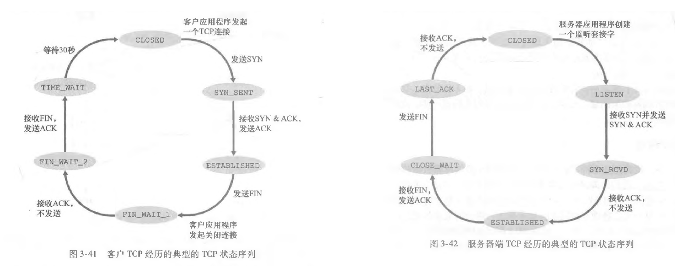
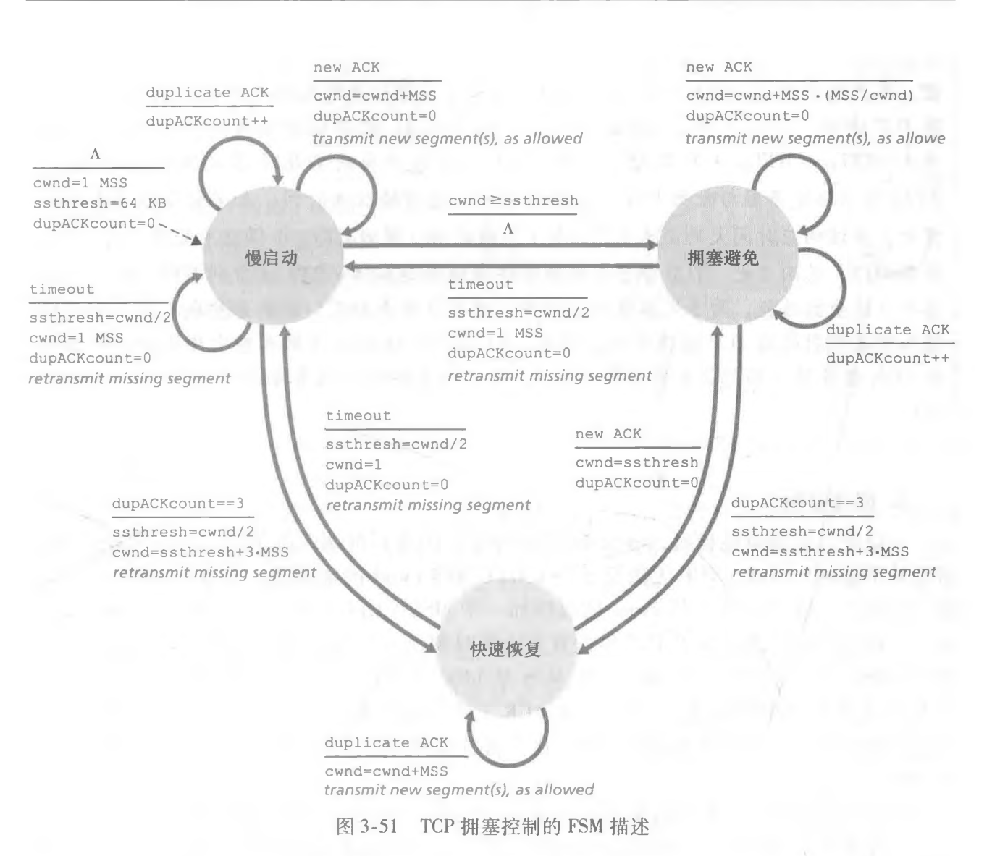

# CS - 260727练习

## 前置

- [计网 - 运输层](../computing-networking/transport-layer.md)


## Quick Start

::: details quick start: tcp-states

:::

:::details quick start: FSM-description-for-TCP-congestion-control 

:::


## Content


### Problem Set # 1

(2026.47) 假设客户端C建立一条TCP连接，向服务器Si上传一个总长度为2000B的计算任务描述文件。已知C的拥塞窗口初始阈值为8MSS，MSS=500B，$S_{i}$对收到的每个TCP段进行确认，且确认段不发送数据。接收窗口始终为1000B，RTT=5ms，C建立连接时选择的初始序号为1000，$S_{i}$选择的初始序号为2000，SYN、ACK、FIN为标志位，seq为序号，ack_seq为确认序号。在整个文件传输过程中未出现任何重传或报文段丢失。

[47题图，无用]

(1) C 与 $S_i$ 建立TCP连接过程需要几次握手？ C 收到的 SYN=1、 ACK=1 的TCP段的确认序号是多少？
(2) 当 C 接收 $S_i$ 发送的 ACK=1,seq=2001,ack_seq=2001,ack_seq=2001,rwnd=1000确认段后
，C的拥塞窗口增加到多少？C的发送窗口设置为多少？
(3) C 与 $S_i$ 释放TCP连接过程需要几次挥手？C收到最后一个TCP报文段的序号(seq)、确认序号(ack_seq)、FIN的值分别是多少？
(4) 忽略报文段传输时延，且时间从C请求建立TCP连接时刻算起，则C确定$S_i$已成功接收到文件的时间是多少？

 - sol_myself:

:::preview 理想发送情况 · plantuml

@startuml 
participant 客户端C as Alice
participant 服务器Si as Bob
Alice->Bob : SYN，seq = 1000
return SYNACK, seq = 2000, ack_seq = 1000 + 1 = 1001
Alice->Bob: seq = 1001 [1 MSS],ack_seq = 2000 + 1 = 2001, 
return seq = 2001, ack_seq = 1001 + [1MSS] = 1501
Alice->Bob: seq = 1501 [2 MSS], ack_seq = 2001 + 1 = 2002
return seq = 2002, ack_seq = 1501 + 2MSS = 2501
Alice->Bob: seq = 2501 [1MSS] // cwnd=4MSS，但文件总长度只有2000B. \n ack_seq = 2002 + 1 = 2003
return seq = 2003, ack_seq = 2501 + [1MSS] = 3001
Alice->Bob: FIN, seq = 3001, ack_seq = 2003 + 1 = 2004
return FINACK, seq = 2004, ack_seq = 3001 + 1 = 3002
Bob->Alice: FIN. seq = 2004 + 1 = 2005, ack_seq = 3002
return FINACK, seq = 3002, ack_seq = 2005 + 1 = 2006

@enduml

:::

```text
(1)
TCP建立连接需要三次握手.
C收到的SYNACK的确认序号 = C的初始序号+1 = 1000 + 1 = 1001.
(2)
慢启动阶段，拥塞窗口的增长方式为 每 new ACK / MSS.
由 ack_seq=2001 和 C的初始序号1000得， 已成功确认1000B = 2 MSS
故 cwnd = 1MSS + 2MSS = 3MSS = 1500B.
发送窗口 = min{cwnd, rwnd} = 1000B.
(3)
TCP释放连接需要四次挥手.
如图，客户端C收到的最后一个TCP报文段是服务器发来的FIN报文，
报文段序号seq=2005,
确认序号ack_seq=3002,
FIN字段被置为1.
(4)
如图，从发送SYN起到接收最后一个数据确认报文(发送第一个FIN前)
共需 4 个 RTT = 4 * 5ms = 20ms.

```

---

(2023.47) 某网络拓扑如图所示，主机H登录FTP服务器后，向服务器上传一个大小为18000B的文件F。 ...


### Problem Set # 2

(2025.38) 主机甲通过TCP向主机乙发送数据的部分过程如下图所示，seq为序号，ack_seq为确认序号，rcvwnd为接收窗口。 甲在 $t_0$时刻的拥塞窗口和发送窗口均为 2000B，拥塞控制阈值为 8000B，MSS=1000B。甲始终以 MSS 发送 TCP 段。若甲在 $t_1$ 时刻收到如图所示的确认段，则甲在未收到新的确认段之前，还可以继续向乙发送的 TCP 段数是 <ins>  2</ins>。


 - sol_myself:


---

(2024.38) 假设主机 H 向服务器发送长度为 3000 B 的报文，往返时间 RTT = 10 ms，最长报文段寿命 MSL=30s，最大报文段长度MSS=1000B，忽略TCP段的传输时延，报文段传输结束后H首先请求断开连接，则从H请求建立TCP连接时刻起，到H进入CLOSED状态为止，所需时间至少是 <ins>60.04s</ins>

 - sol_myself:
```text
 - 发送任务 3000B = 3MSS
 - 计算发送窗口:
   - 由"至少"一词，不考虑rwnd，假设cwnd从1MSS开始成倍增长。
   - 则发送数据的段为: [1MSS], [2MSS]
 - 连接管理过程:
     - 连接创立的前两次握手: 1 RTT
     - 发送数据: 2 RTT
     - 连接销毁: 1 RTT + 2 MSL
 - 总时间: 4RTT + 2MSL = 0.04s + 60s = 60.04s

```

---

(2022.38) 假设主机甲和主机乙已经建立一个TCP连接，最大段长MSS=1KB，甲一直有数据向乙发送，当甲的拥塞窗口为16KB时， 计时器发生了超时，则甲的拥塞窗口再次增长到16KB所需要的时间至少是 <ins>11 RTT</ins> .

 - 拥塞控制算法，(超时) -> `ssthresh = cwnd / 2, cwnd = 1`, 
 - cwnd: 1MSS -> 指数增长 -> ssthresh(8KB) -> 线性增长 -> 16KB
 - 总时间 = 3RTT(指数增长) + 8RTT(线性增长) = 11 RTT .


(2022.39) 假设客户C和服务器S已建立一个TCP连接 ...
 - TCP 连接管理: 销毁，如何进入CLOSED的状态。
 - 从FIN的发起方发起FIN起算，发起方需要 1RTT + 2MSL 进入CLOSED，接收方需要 1.5RTT 进入CLOSED.


---

(2021.38) 若客户首先向服务器发送FIN段请求断开TCP连接，则当客户收到发送的FIN ...
 - TCP 连接管理：FIN的发起方等待两个MSL的那个状态叫 TIME_WAIT . 

(2021.40) 假设主机甲通过TCP向主机乙发送数据，部分过程如下所示。 ...


---

(2020.38) 若主机甲与主机乙已建立了一条TCP连接，最大段长为(MSS)为1KB，往返时间(RTT)为2ms，则在不出现拥塞的情况下，拥塞窗口从8KB增长到32KB的最长时间是 <ins>48ms</ins> .
 - $\color{Red}{\text{最长时间}}$ -> 假设 cwnd 线性增长.
 - time = (32 - 8) RTT = 24RTT = 48ms


(2020.39) 若主机甲与主机乙建立TCP连接时，发送的SYN段中的序号为1000，在断开连接时，甲发送给乙的FIN段中的序号为5001，则在无任何重传的情况下，甲已经向乙发送的应用层数据的字节数为 <ins>4000</ins> .
 - TCP连接管理，TCP报文的序号是其携带的数据的第一个字节在字节流中的编号。
 - 由题目信息得数据的字节范围为[1001 ~ 5000]，共4000字节.

---

(2019.38)

(2019.39)


## 小结
1. 这里练习了一些我一眼看过去比较纯的运输层题目。
2. 不要慌嘛。
