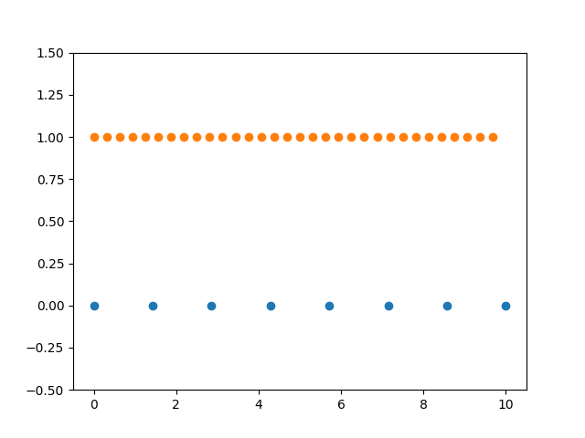

# Python - NumPy

NumPy quick start: [https://numpy.org/doc/stable/user/quickstart.html#quickstart-tutorial]

---

## import

```python
import numpy as np
```

## 调用

### `numpy.linspace`

```python
numpy.linspace(start, stop, num=50, endpoint = True, ...)
```

- `start` - 起始
- `stop` - 终止
- `num` - 生成的点的个数
- `endpoint` - 是否以`stop`的值作为最后一个样本值

例子：

<VPPreview>

<template #code>

```python
import matplotlib.pyplot as plt
import numpy as np
N = 8
y = np.zeros(N)

x1 = np.linspace(0, 10, N, endpoint=True)
plt.plot(x1, y, 'o')

M = N * 4
y2 = np.ones(M)

x2 = np.linspace(0, 10, M, endpoint=False)
plt.plot(x2, y2, 'o')
plt.ylim([-0.5, 1.5]) #限制图像显示的y轴范围

plt.show()
```

</template>
<template #content>



</template>

</VPPreview>

参见 [https://numpy.org/doc/stable/reference/generated/numpy.linspace.html#numpy-linspace]

---

## `numpy.random`

### `numpy.random.randn`

```python
numpy.random.randn(d0, d1, ..., dn)
```

返回一个形状为(d0, d1, ..., dn)的数组，其中包含从均值为 $0$ 、 方差为 $1$ 的单变量正态分布(高斯分布)中随机抽取的浮点数。

```python
import matplotlib.pyplot as plt
import numpy as np

s = np.random.randn(2, 3, 4)
print(s)
# [[[-0.46596968  0.42620338 -0.32811471 -0.942894  ]
#   [-1.15998087 -0.44689506  0.04885399  0.14155802]
#   [ 1.73304018  1.80588365 -0.90831749 -0.2114057 ]]

#  [[-0.65709564 -0.92226249 -0.57735874 -0.76820169]
#   [ 0.42402572  0.80223467 -0.34365807  0.61602056]
#   [ 0.32185198 -0.07000579 -1.31744733 -1.1722718 ]]]
```

::: left
参见 [https://numpy.org/doc/stable/reference/random/generated/numpy.random.randn.html#numpy.random.randn]
:::

---
